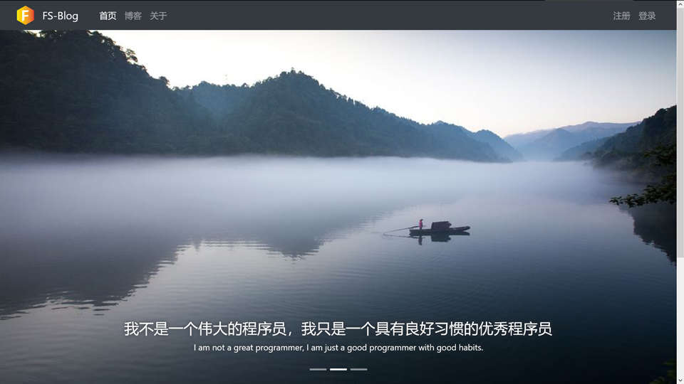
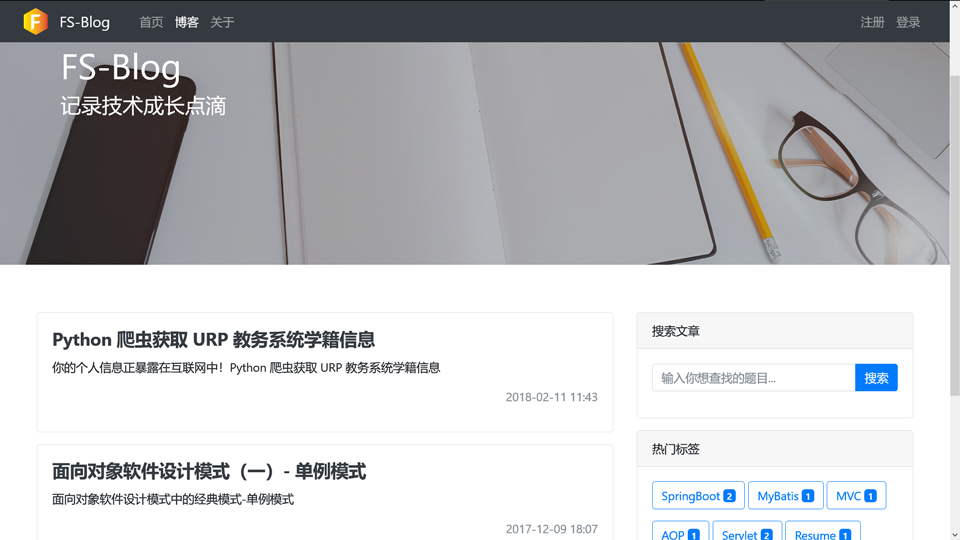
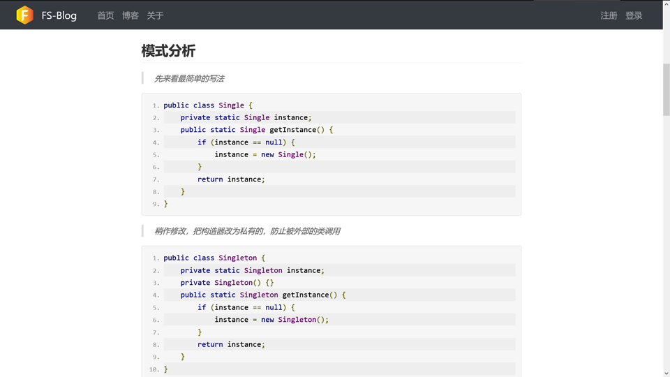
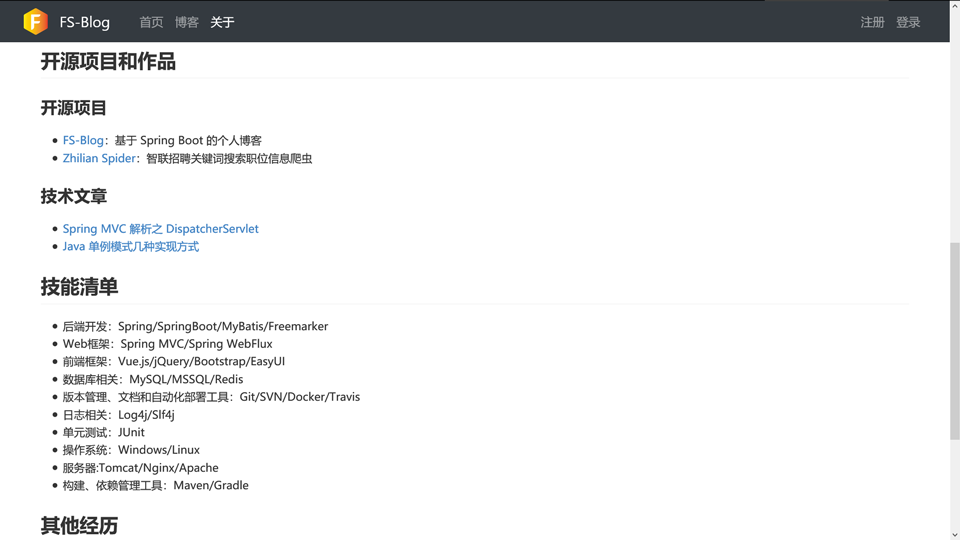

    

# FS-Blog

## 基于 Spring Boot 的个人博客

### 1. 涉及技术及工具

- 核心框架：SpringBoot
- ORM 框架：MyBatis
- MyBatis 工具：MyBatis Mapper 
- MVC 框架：Spring MVC
- 模板引擎：Freemarker
- 编译辅助插件：Lombok
- CSS 框架：BootStrap 4.0
- Markdown 编辑器：Editor.md
- 数据库：MySQL

### 2. 效果图

#### 2.1 首页

#### 2.2 博客列表页

#### 2.3 博客阅读页

#### 2.4 个人简历页

### 3. 构建及运行

#### 3.1 服务器环境

- 安装 ``MySQL``
- 安装 ``Gradle``
- 在项目目录下运行 ``gradle clean build``，生成的 jar 包位于 ``build/libs`` 目录下，使用 ``java -jar .../fsblog.jar`` 运行
- 在 ``application-dev.yml`` 中配置数据库用户名和密码，默认为：``username: root password: root``
- 默认自动创建数据库、数据表并自动导入初始数据，同样在``application-dev.yml``中配置

#### 3.2 开发环境

- 可直接在 IntelliJ IDEA 或 Eclipse 中打开项目进行二次开发

### 4. 联系方式

QQ：1146556298

Email：zhengbaole_1996@163.com

### 5. 相关链接

- FS-Blog [在线 Demo](http://fsblog.letec.top)

- 我的个人博客 [James' Blog](http://jameszbl.github.io)

### 6. 开源协议

[Apache License 2.0](http://apache.org/licenses/LICENSE-2.0.html)

Copyright (c) 2017-present, JamesZBL